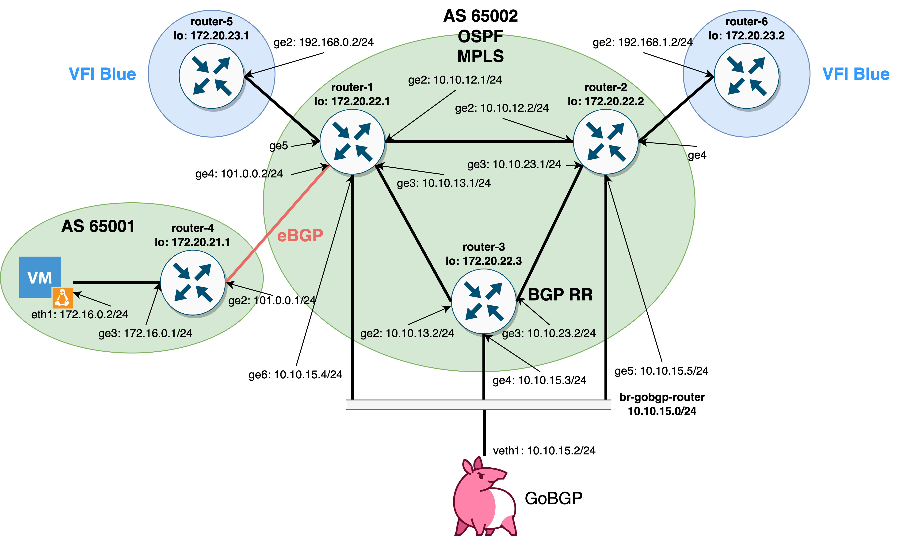

# L2VPN VPLS Network Lab

Lab topology:


Before running make sure you installed [Containerlab](https://containerlab.dev), docker, Cisco IOS image and [GoBGP](https://github.com/osrg/gobgp)

Generate ssh keys and create Linux bridge:
```
./run_ssh_keygen.sh
sudo ./create_bridge.sh
```

Afterwards, start a containerlab lab:
```
sudo clab deploy --topo vpn_lab.yml
```

Wait until all containers will be in 'healthy' state (you can check it via '`docker ps -a`' command). Afterwards, you are ready to configure routers, just run:
```
./configure_routers.sh
```

Now we can also start GoBGP instance:
```
sudo -E gobgpd -f gobgp_conf.toml 
```

By default GoBGP is connected to all routers (router-1 and router-2 are PEs, router-3 is Route Reflector). BGP table in GoBGP is the following:
```
~$ gobgp global rib -a l2vpn-vpls
   Network                                                 Next Hop             AS_PATH              Age        Attrs
*> 65002:63:101:100 (Block Size: 10, Label Block Base: 16) 172.20.22.1                               00:00:05   [{Origin: ?} {Med: 0} {LocalPref: 100} {Extcomms: [65002:63], [encaps: VPLS, control flags:0x0, mtu: 1500]}]
*  65002:63:101:100 (Block Size: 10, Label Block Base: 16) 172.20.22.1                               00:00:03   [{Origin: ?} {Med: 0} {LocalPref: 100} {Extcomms: [65002:63], [encaps: VPLS, control flags:0x0, mtu: 1500]} {ClusterList: [172.20.22.3]} {Originator: 172.20.22.1}]
*> 65002:63:102:100 (Block Size: 10, Label Block Base: 29) 172.20.22.2                               00:00:04   [{Origin: ?} {Med: 0} {LocalPref: 100} {Extcomms: [65002:63], [encaps: VPLS, control flags:0x0, mtu: 1500]}]
*  65002:63:102:100 (Block Size: 10, Label Block Base: 29) 172.20.22.2                               00:00:03   [{Origin: ?} {Med: 0} {LocalPref: 100} {Extcomms: [65002:63], [encaps: VPLS, control flags:0x0, mtu: 1500]} {ClusterList: [172.20.22.3]} {Originator: 172.20.22.2}]
~$ gobgp global rib
   Network              Next Hop             AS_PATH              Age        Attrs
*> 172.16.0.0/24        172.20.22.1          65001                00:00:06   [{Origin: i} {Med: 0} {LocalPref: 100}]
*  172.16.0.0/24        172.20.22.1          65001                00:00:12   [{Origin: i} {Med: 0} {LocalPref: 100} {ClusterList: [172.20.22.3]} {Originator: 172.20.22.1}]

```
